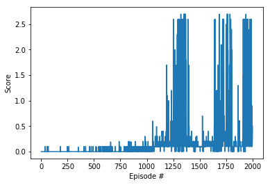

# Report on project 3 (tennis)

In this environment, two agents control rackets to bounce a ball over a net. If an agent hits the ball over the net, it receives a reward of +0.1. If an agent lets a ball hit the ground or hits the ball out of bounds, it receives a reward of -0.01. Thus, the goal of each agent is to keep the ball in play.

The observation space consists of 8 variables corresponding to the position and velocity of the ball and racket. Each agent receives its own, local observation. Two continuous actions are available, corresponding to movement toward (or away from) the net, and jumping.

The task is episodic, and in order to solve the environment, your agents must get an average score of +0.5 (over 100 consecutive episodes, after taking the maximum over both agents). Specifically,

After each episode, we add up the rewards that each agent received (without discounting), to get a score for each agent. This yields 2 (potentially different) scores. We then take the maximum of these 2 scores.
This yields a single score for each episode.
The environment is considered solved, when the average (over 100 episodes) of those scores is at least +0.5.

## How to Solve

I am using MADDPG algroithm to solve this problems the DDPG agent is based on my second project (continuous control) which is ddpg and that ddpg algro is baseed on the ddpg-pendulum. The Agents class handling the multi agent 
method. 

the actor and critic agent are 2 fully connected with 2 hidden layers of 256 nodes. and the hyperparameters shown below.

the agent solved at 1304 episodes and satisfy the requirement.

```
BUFFER_SIZE = 100000  #int(1e5) # replay buffer size
BATCH_SIZE = 256 #fc1,2 == 256        # minibatch size
GAMMA = 0.90            # discount factor
TAU = 1e-3              # for soft update of target parameters
LR_ACTOR = 0.001 #1e-4         # learning rate of the actor 
LR_CRITIC = 0.001 #1e-3        # learning rate of the critic
WEIGHT_DECAY = 0.00001   #1e-6 #0      # L2 weight decay
SIGMA = 0.1
```



## Ideas for Future Work

different approach of implement maddpg based on [shangton ](https://github.com/ShangtongZhang/DeepRL/tree/master/deep_rl/agent), his works really amazing,

try completed all challenge porject, and optional tutorials

if possible, put my knowledge to solve realworld prblem(s) with machine learning.